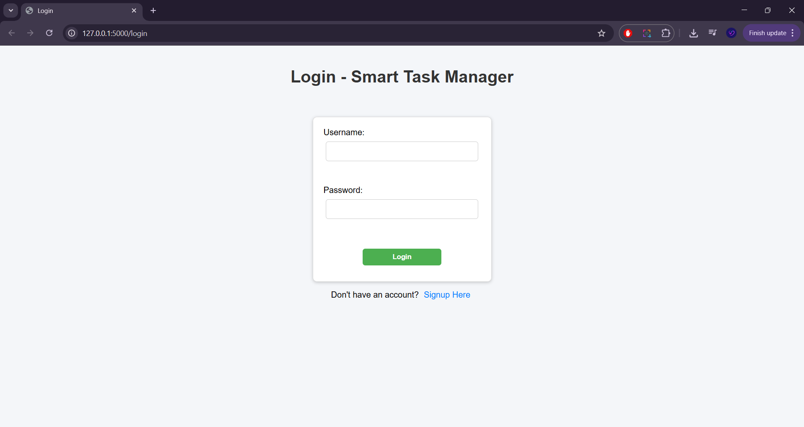
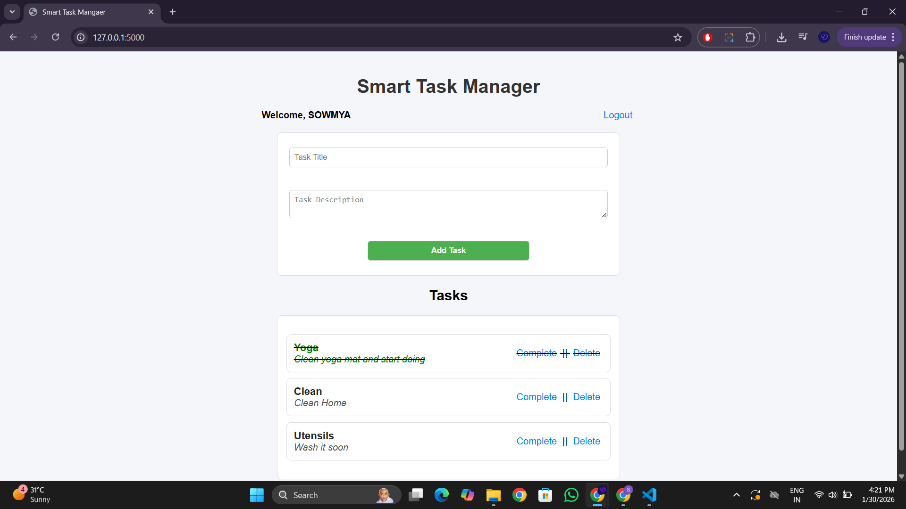

# Smart Task Manager

A full-stack web application built with **Python, Flask, and MySQL** for managing user-specific tasks.  
This project was developed as part of my learning journey to strengthen backend and frontend development skills.

---

## 🚀 Features
- User **signup/login** with session handling  
- Add, update, delete, and mark tasks as completed  
- Strikethrough styling for completed tasks using CSS  
- User-specific task management (each user sees only their tasks)  
- Clean and simple UI with HTML & CSS  

---

## 🛠️ Tech Stack
- **Backend:** Python, Flask  
- **Database:** MySQL  
- **Frontend:** HTML, CSS, JavaScript (basic)  
- **Tools:** Git, VS Code  

---

## 📂 Project Structure
Smart-Task-Manager/  
│  
├── app.py                 # Main Flask application  
├── db.py                  # Database connection file  
├── requirements.txt       # Dependencies  
├── schema.sql             # Database schema  
├── templates/            # HTML templates  
│   ├── index.html  
│   └── login.html  
├── static/               # CSS & JS files  
│   ├── style.css  
│   └── script.js  
└── README.md              # Project documentation  


---

## ⚙️ Installation & Setup
1. Clone the repository:
   ```bash
   git clone https://github.com/your-username/Smart-Task-Manager.git
   cd Smart-Task-Manager
   
2. Create a virtual environment and install dependencies:
   ```bash
   pip install -r requirements.txt
   
4.  Set up the MySQL database:

  -> Create a database (e.g., task_manager)  
  -> Run schema.sql to create tables  
  
4. Update database credentials in db.py (host, user, password, db name)  
  
5. Run the Flask app:  
   python app.py  
  
6. Open in browser:  
   http://127.0.0.1:5000
  
##Screenshots:
Login page:  


User based tasks:  

